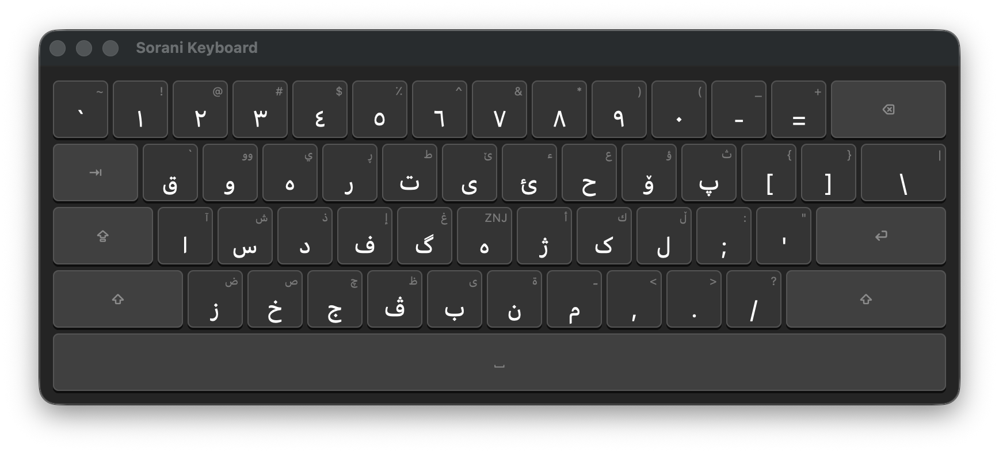
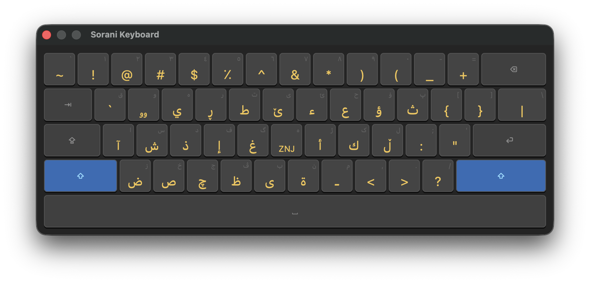

# Kurdish Sorani Keyboard

**کیبۆردی کوردی سۆرانی بۆ macOS**

A native Sorani Kurdish input method for macOS, available on the Mac App Store.

**Author:** Nafeh Muhammed Mahmoud — نافع محمد محمود  
**Requires:** macOS 14 Sonoma or later  
**Price:** Free

---

## What is this?

Kurdish Sorani Keyboard adds **Kurdish — Sorani** as a native input source to macOS. Once activated, you switch between Kurdish and English the same way you switch between any two languages — using the Input Source icon in your menu bar or a keyboard shortcut. No third-party tools, no Accessibility permission, no workarounds.

---

## Installation

Download from the **Mac App Store** and launch the app. On first launch, a setup window walks you through activation:

1. Open **System Settings → Keyboard → Input Sources**
2. Click **+**
3. Search for **"Sorani"**
4. Select **Kurdish — Sorani** and click **Add**

A **ک** icon appears in your menu bar. You're ready.

---

## How to Use

Switch to Kurdish — Sorani using the Input Source icon in your menu bar (or press **Ctrl+Space** / **⌘Space** depending on your shortcut settings).

**Menu bar ک icon:**
- **Show Keyboard Viewer** — opens a floating window showing the full Kurdish layout
- **Quit Kurdish Sorani Keyboard**

**Keyboard Viewer:**
- Shows all characters in base and shifted layers
- Hold **Shift** on your physical keyboard — the viewer updates in real time
- Click **⇧** or **⇪** in the viewer to toggle shift / caps lock
- Click any character key to type it into the focused app

---

## Key Layout

Each key shows: plain (no Shift) / shifted (+ Shift)

### Letter Keys

| Key | Plain | Shift | Key | Plain | Shift |
|-----|-------|-------|-----|-------|-------|
| q | ق | ` | a | ا | آ |
| w | و | وو | s | س | ش |
| e | ە | ي | d | د | ذ |
| r | ر | ڕ | f | ف | إ |
| t | ت | ط | g | گ | غ |
| y | ی | ێ | h | ه | ‌(ZWNJ) |
| u | ئ | ء | j | ژ | أ |
| i | ح | ع | k | ک | ك |
| o | ۆ | ؤ | l | ل | ڵ |
| p | پ | ث | ; | ؛ | : |
| z | ز | ض | / | / | ؟ |
| x | خ | ص | , | ، | < |
| c | ج | چ | . | . | > |
| v | ڤ | ظ | | | |
| b | ب | ى | | | |
| n | ن | ة | | | |
| m | م | ـ | | | |

### Number Row

| Key | Plain | Shift |
|-----|-------|-------|
| 1 | ١ | ! |
| 2 | ٢ | @ |
| 3 | ٣ | # |
| 4 | ٤ | $ |
| 5 | ٥ | ٪ |
| 6 | ٦ | ^ |
| 7 | ٧ | & |
| 8 | ٨ | * |
| 9 | ٩ | ( |
| 0 | ٠ | ) |

Number keys type Arabic-Indic digits (١٢٣...) in base layer. Shift+9 and Shift+0 follow the Windows Kurdish convention: `(` and `)`.

### Option Layer

| Key | Option | Option+Shift |
|-----|--------|-------------|
| e | ZWNJ (‌) | ZWJ (‍) |
| - | – (en dash) | — (em dash) |
| = | ≠ | — |
| . | … | › |
| , | ، | ‹ |
| Space | NBSP | NBSP |

---

## Screenshots

*Base layer — Kurdish Sorani input active*

*Shift layer*

---

## Troubleshooting

**"Sorani" does not appear in Input Sources:**
Quit the app, reopen it from Applications, then try adding the input source again. The app must be running for macOS to register it.

**Characters are not appearing in Kurdish:**
Make sure **Kurdish — Sorani** is selected as the active input source (check the menu bar icon).

**Keyboard Viewer click-to-type is not working:**
The Keyboard Viewer is a visual reference. Clicking keys may not type in all apps depending on system permissions. Use your physical keyboard to type.

---

## Privacy

This app collects no data, requires no internet connection, and uses no tracking. See [PRIVACY.md](PRIVACY.md).

---

## License

[MIT](LICENSE) — © 2026 Nafeh Muhammed Mahmoud (نافع محمد محمود)
